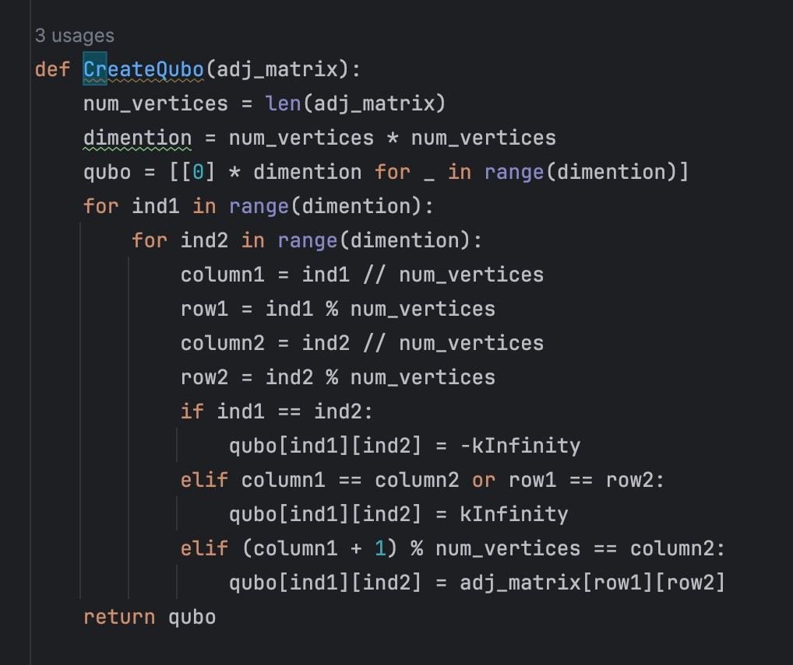
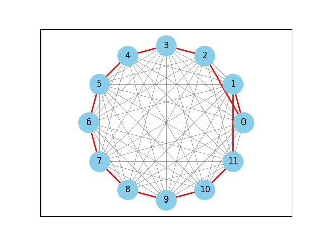
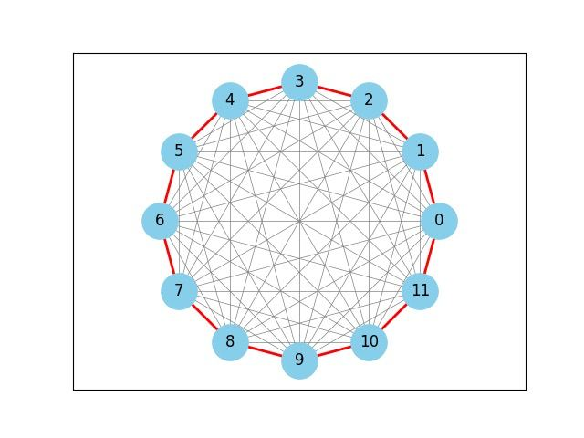
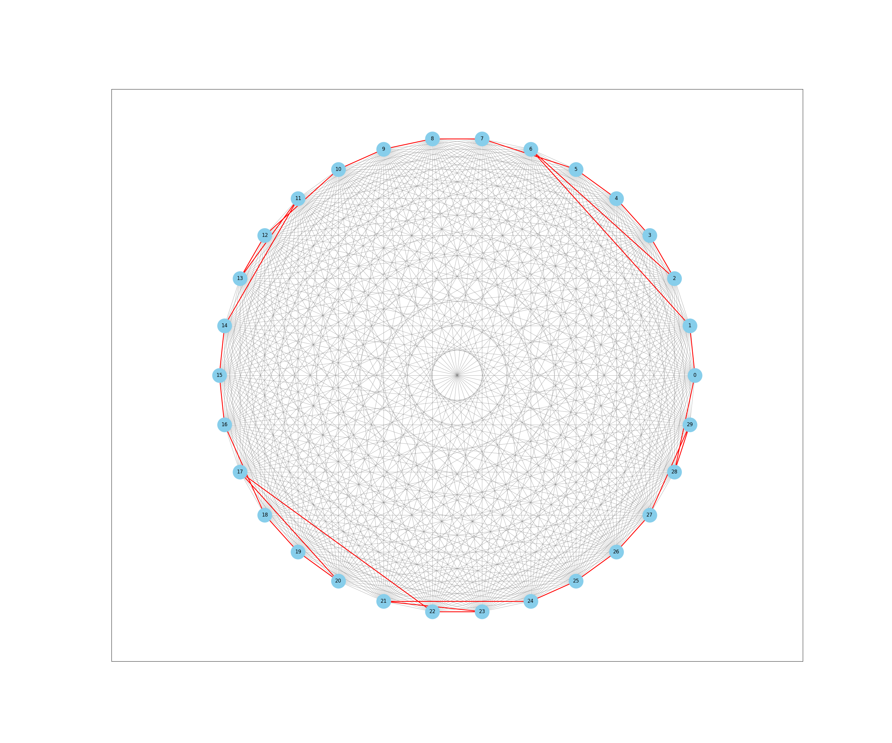
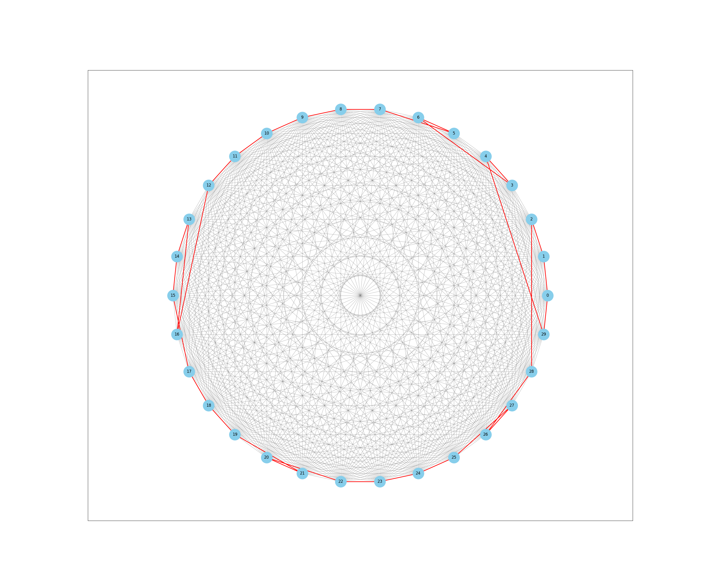
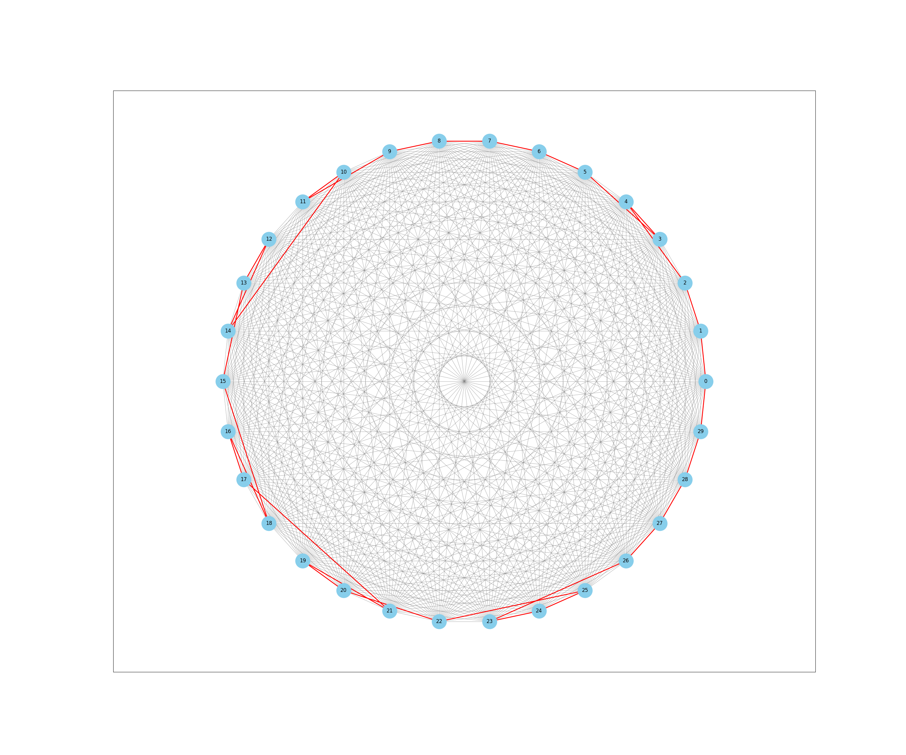

# Корректность составления матрицы QUBO

## Построение матрицы QUBO

Задача: коммивояжёр с возвращением обратно.

Решателем в следующих тестах является Steepest Descent Solver by D-Wave

## Тест на многоульнике из 10 вершин

Параметр reads = 1000

Параметр reads = 1200

### Вывод

На малом кол-ве вершин можно добиться нужной точности ответа за приемлемое время выполнения

## Тест на многоульнике из 30 вершин

Параметр reads семплера=1000

Параметр reads семплера=5000

Как можно видеть мало что поменялось

Параметр reads семплера=30000

Как бы не повышали точность, семплер выдает неприемлемый ответ за непростительное время работы

## Полезные ссылки

Много Ising-сформулированных классических задач. [ссылка](https://arxiv.org/pdf/1302.5843.pdf).

Вариант Ising-формулировки TSP с раскрытием скобок. [ссылка](https://www.ece.ualberta.ca/~jhan8/publications/SB_TSP_ISOCC_Submitted.pdf).

