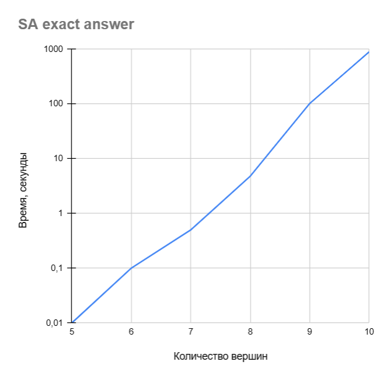

# Экспоненциальная сложность
Задача коммивояжёра является NP-сложной и классические неоптимизационные алгоритмы (которые дают точный ответ) имеют экспоненциальную сложность. Но получение точного ответа с около 100%-ой вероятностью можно добиться и с помощью оптимизационных алгоритмов. Ниже приведены данные, показывающие, что сложность при таком подходе остаётся экспоненциальной.
## Результаты

Задача: TSP.

Тесты проводились на сэмплере Simulated Annealing с дефолтными параметрами, кроме num_reads, который увеличивался, пока хотя бы в 28/30 запусков не получался точный ответ. Вершины были расположены в форме правильного многоугольника.

|Обычная шкала|Логарифмическая шкала|
|---|---|
|||

Получение точного ответа на оптимизационном алгоритме требует гораздо больше времени, даже чем простой перебор, в связи с особенностью QUBO формулировки, в которой количество булевых переменных составляет квадрат от количества вершин.
## Полезные ссылки

Получение точного ответа с помощю динамического программирования с графиками. [ссылка](https://habr.com/ru/articles/701458/).

Получение приближённого к точному ответа на сэмплерах. [Primary-analysis](../Primary-analysis).
