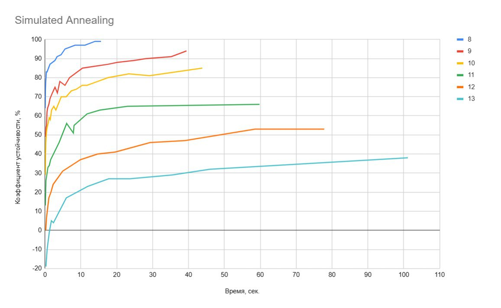
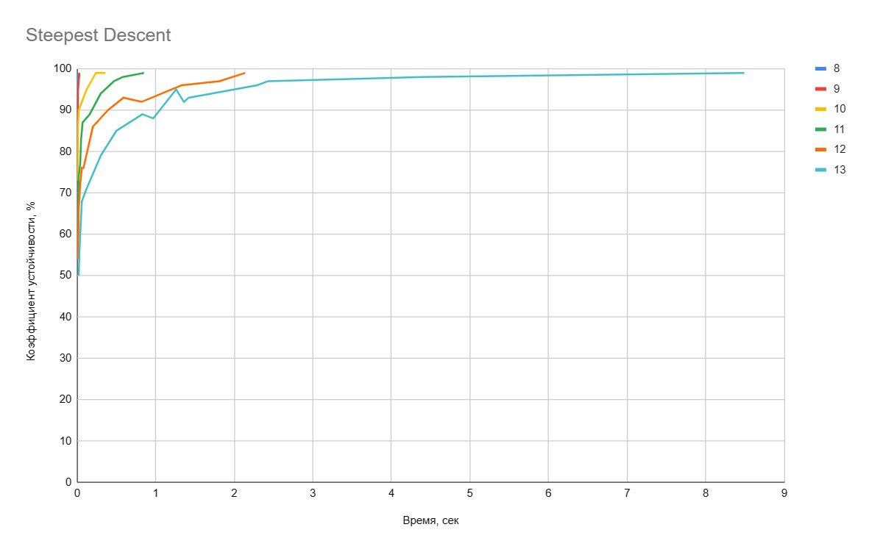
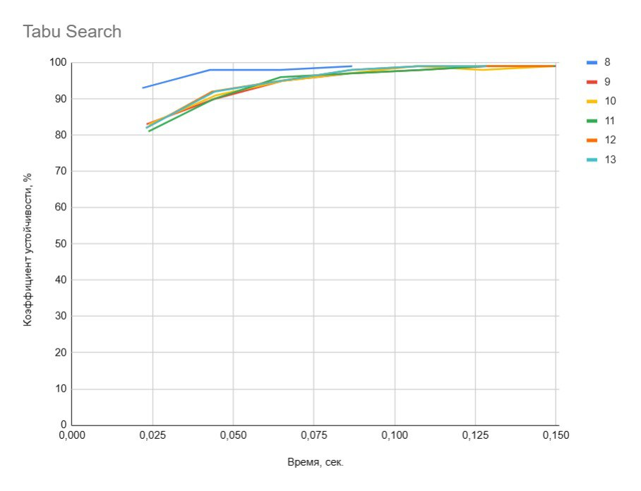
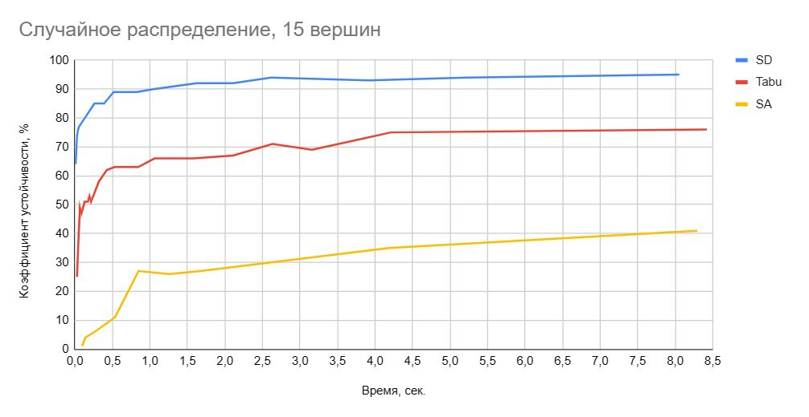

# Анализ v2
## Графики
### Правильный многоугольник
TSP на правильном многоугольнике с градацией по количеству вершин (разные цвета линий).

Из этих тестов видно, что по эффективности сэмплеры расположены в следующем порядке по убыванию: Tabu, SD, SA.
### Рандомное
С учётом особенного поведения Tabu на правильном многоугольнике, указанном в [Types-of-graphs](../Types-of-graphs), фиксируем сложность задачи в 15 вершин и берём случайное распределение.

Таким образом, здесь по убыванию эффективности сэмплеры расположены в  следующем порядке: SD, Tabu, SA.
