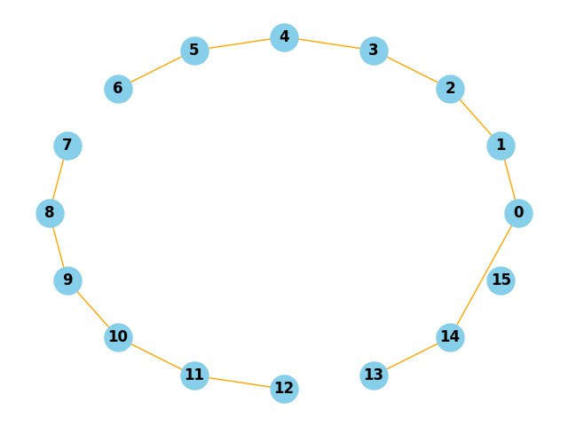
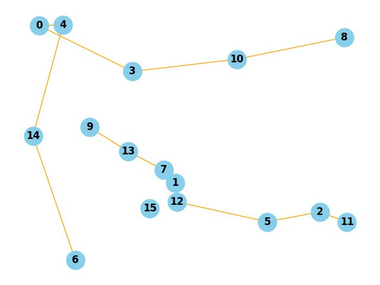

# Множественный коммивояжёр
## Постановка задачи
Даны неориентированный граф и число автомобилей(коммивояжёров) - $m$, нужно найти $m$ путей наименьшего веса, которые в совокупности покрывают все вершины графа.
## QUBO формулировка
Введём булеву переменную $x_{a,i,v}$ которая принимает значение $1$, если автомобиль $a$ в $i$-ый момент времени находится в вершине $v$, иначе - $0$.

Если в задаче с одним автомобилем мы изначально знали, какое количество вершин он должен посетить, то теперь каждая машина может иметь своё количество посещённых городов. То есть изначально подобрать для каждой машины длину пути невозможно, так как нахождение длин путей для каждой машины это часть задачи. В связи с этим шкалу времени нужно выбрать достаточную, чтобы не сужать пространство вариантов решений, и, как следствие, необходимо позволить машинам оставаться в вершинах некоторое время, чтобы полностью заполнить шкалу времени. 

Предлагается ввести особую вершину $depo$, с которой будет начинаться путь, и в которую машина будет возвращаться после посещения отведённых ей вершин. Таким образом, путь будет выглядеть как $depo\rightarrow v_1\rightarrow v_2\rightarrow ...\rightarrow v_k \rightarrow depo\rightarrow ...\rightarrow depo$. Тогда можно оставить ограничения на пребывание в одной вершине только в один момент времени для обычных вершин, а для $depo$ сделать ряд исключений и новых ограничений.

Пусть $A$ - количество автомобилей, пусть $n$ - количество обычных вершин в графе, тогда с учётом начала и конца пути в особой вершине $P = n + 2$ - длина шкалы времени, $N = n + 1$ - количество вершин с учётом $depo$, которому присвоим номер $N$.

$$ H = kA \cdot \sum_{v=1}^{N-1} ( \sum_{a=1}^{A} \sum_{i=1}^{P} x_{a,i,v} - 1)^2 + kB \cdot \sum_{a=1}^{A} \sum_{i=1}^{P} ( \sum_{v=1}^{N} x_{a,i,v} - 1)^2 + kC \cdot \sum_{a=1}^{A} \sum_{1 \leq i < j \leq P} \sum_{v=1}^{N-1} x_{a,i,N} x_{a,j,v} -kD \cdot \sum_{a=1}^{A}(x_{a,0,N} + x_{a,P,N}) + kE \cdot \sum_{a=1}^{A} \sum_{i=2}^{P-1} \sum_{v=1}^{N} \sum_{u=1}^{N} x_{a,i,v} x_{a,i+1,u} \omega (v,u)$$

$kA, kB, kC, kD, kE$ - некоторые балансирующие коэффициенты.

* Первая сумма отвечает за то, чтобы каждая вершина, кроме $depo$, среди всех машин и моментов времени встречалась ровно один раз.
* Вторая сумма отвечает за то, чтобы каждая машина в каждый момент времени находилась только в одной вершине.
* Третья сумма отвечает за то, чтобы после попадания в $depo$, машина оставалась в нём (не учитывается начальный момент времени, когда мы стартуем из $depo$).
* Четвёертая сумма отвечает за то, чтобы каждая машина начинала и заканчивала в $depo$.
* Пятая сумма отвечает за вес рёбер в пути, который нужно минимизировать (если между вершинами нет ребра, то вес считается бесконечным, у $depo$ есть рёбра со всеми вершинами и их вес равен нулю).

<details>
<summary> 
  Построение QUBO матрицы
</summary>

```
def MakeQuboPolyTSP(graph, autos):
    amount_of_vertexes = len(graph)       # amount_of_vertexes = N
    dimentions = autos * amount_of_vertexes * (amount_of_vertexes + 1)
    qubo = [[0] * dimentions for i in range(dimentions)]

    for a1 in range(0, autos):     # x_a_i_v auto, time, vertex
        for a2 in range(0, autos):
            for i in range(0, amount_of_vertexes + 1):
                for j in range(0, amount_of_vertexes + 1):
                    for v in range(0, amount_of_vertexes):
                        for u in range(0, amount_of_vertexes):
                            row = a1 * (amount_of_vertexes + 1) * amount_of_vertexes + i * amount_of_vertexes + v
                            column = a2 * (amount_of_vertexes + 1) * amount_of_vertexes + j * amount_of_vertexes + u
                            if (row == column) :
                                if ((i == 0 and v == amount_of_vertexes - 1) or (i == amount_of_vertexes and v == amount_of_vertexes - 1)) :
                                    qubo[row][column] -= kD         # Четвёртая сумма
                                if (v != amount_of_vertexes - 1) :
                                    qubo[row][column] += -kA -kB    # линейное слагаемое с обычной вершиной
                                else:
                                    qubo[row][column] += -kB        # линейное слагаемое с депо 
                            else :
                                if (v == u and v != amount_of_vertexes - 1) :
                                    qubo[row][column] += 2*kA               # Квадратичное слагаемое из первой суммы
                                if (a1 == a2 and i == j and v != u):
                                    qubo[row][column] += 2*kB               # Квадратичное слагаемое из второй суммы
                                if (a1 == a2 and (j > i and v == amount_of_vertexes - 1 and u != amount_of_vertexes - 1 and i != 0) or (i > j == 1 and u == amount_of_vertexes - 1 and v != amount_of_vertexes - 1 and j!= 0)) :
                                    qubo[row][column] += kC                  # Третья сумма
                                if (a1 == a2 and abs(i - j) == 1) :
                                    qubo[row][column] += kE * graph[u][v]    # Пятая сумма
```                                    
  
</details>

На практике использовались следующие значения констант:
```
kA = 1e7
kB = 1e7
kC = 1e7
kD = 1e7
kE = 1
```

## Примеры
Результаты решения на сэмплере Dwave SteepestDescent. Возможно не самое оптимальное решение.




