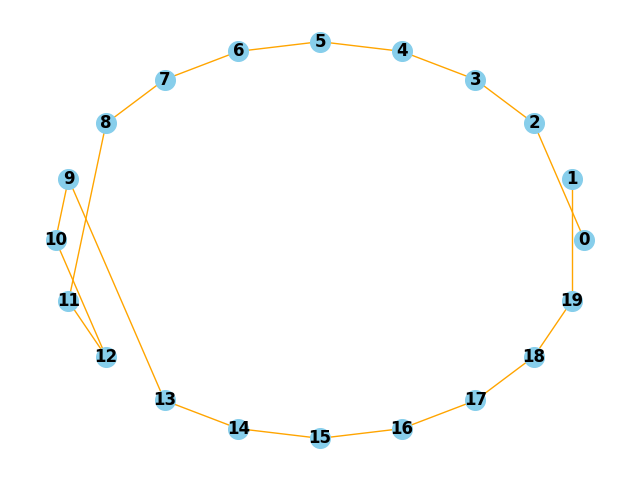
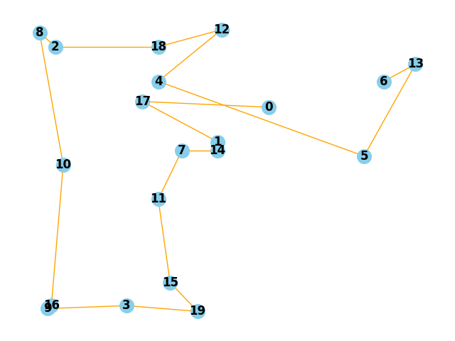
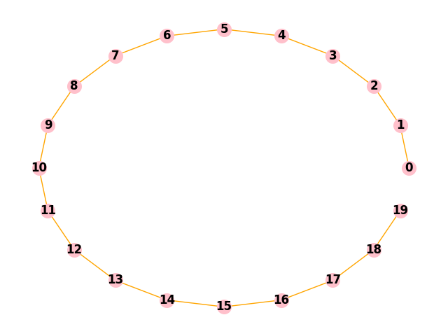
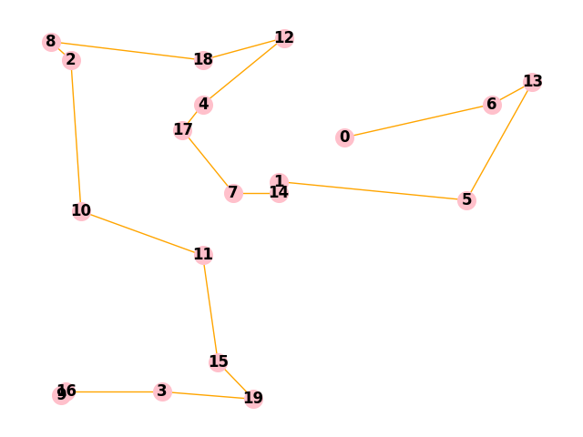

# Влияние характера распределения вершин на точность ответа
## Построение
Рассматриваются два типа распределения вершин на ограниченной плоскости: случайное и в форме правильного многоугольника.

<details>
  
<summary>
   Построение правильного многоугольника
</summary>

```
def GeneratePolygon(amount_of_vertexes) :
    graph = [[0] * amount_of_vertexes for i in range(amount_of_vertexes)]
    vertexes = []
    for i in range(amount_of_vertexes):
        angle = 2 * i * 3.14159 / amount_of_vertexes  # Вычисление угла для каждой вершины
        x = round(100 * (0.5 + 0.5 * math.cos(angle)), 2)  # X координата
        y = round(100 * (0.5 + 0.5 * math.sin(angle)), 2)  # Y координата
        vertexes.append((x, y))

    for i in range(amount_of_vertexes) :
        for j in range(amount_of_vertexes) :
            if (i == j) :
                continue
            graph[i][j] = round(euclidean_distance(vertexes[i], vertexes[j]), 2)
    return graph
```

</details>

<details>

<summary>
  Построение случайного распределения.
</summary>

  ```
  def GenerateFullPlot(amount_of_vertexes) :
    graph = [[0] * amount_of_vertexes for i in range(amount_of_vertexes)]
    vertexes = []
    for i in range(amount_of_vertexes):
        x = random.randint(1, 100)  # X координата
        y = random.randint(1, 100)  # Y координата
        vertexes.append((x, y))    

    for i in range(amount_of_vertexes) :
        for j in range(amount_of_vertexes) :
            if (i == j) :
                continue
            graph[i][j] = round(euclidean_distance(vertexes[i], vertexes[j]), 2)
    return graph
  ```
  
</details>

## Результаты

### Steepest Descent, 20 vertexes

| |Polygon |Random|
| ------- | ------- | ------- |
|gap, %| 44| 25.5|
|time, sec.| 1.24 |1.22|


### Simulated Annealing, 10 vertexes

||Polygon|Random|
| ------- | ------- | ------- |
|gap, %| 27| 14.5|
|time, sec.| 6.16| 5.91|

## Примеры

 | |Polygon|Random|
 |---|---|---|
 |SD|  | |
 |Dynam| |  |

 На правильном многоугольнике отклонение от эталонного ответа, полученного с помощью решения динамическим программированием, составило ~ 40%.

 На случайном распределении отклонение составило ~ 16%.

 Во всех тестах использовалось значение num_reads = 10 000.
