# Первичный анализ
## Постановка задачи
Дана карта городов, между любыми двумя есть двусторонняя дорога, движение по которой занимает фиксированное время. В одном определённом городе находится
коммивояжёр, который должен посетить все города за наименьшее время (возвращение в начальный город не учитывается). Нужно найти такой маршрут.


Для тестов использовалась генерация полных графов со случайными весами рёбер от 1 до 100 включительно.


<details>
<summary>
  def GenerateFullGraph
</summary>
  
```
def GenerateFullGraph(amount_of_vertexes) :
    graph = [[0] * amount_of_vertexes for i in range(amount_of_vertexes)]
    for i in range(amount_of_vertexes) :
        for j in range(i + 1, amount_of_vertexes) :
            weight = random.randint(1, kMaxWeight)
            graph[i][j] = weight
            graph[j][i] = weight
    return graph
```
</details>

В качестве эталонного ответа использовался результат динамического решения задачи из библиотеки [python_tsp](https://pypi.org/project/python_tsp/).
## Steepest Descent
Результаты тестов на дефолтных параметрах сэмплера.

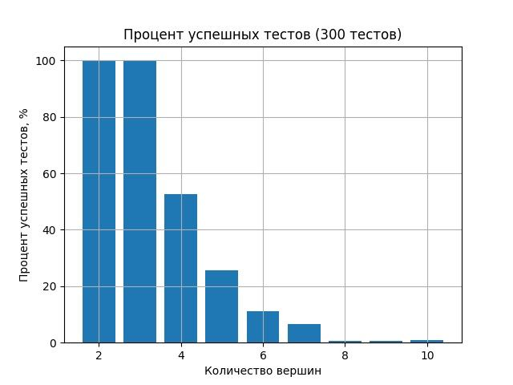

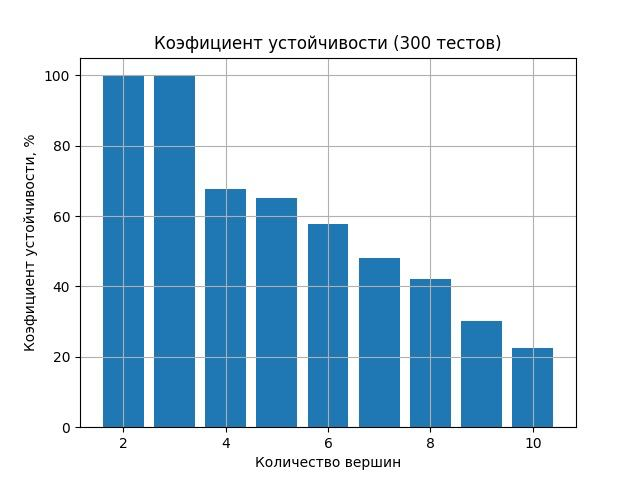

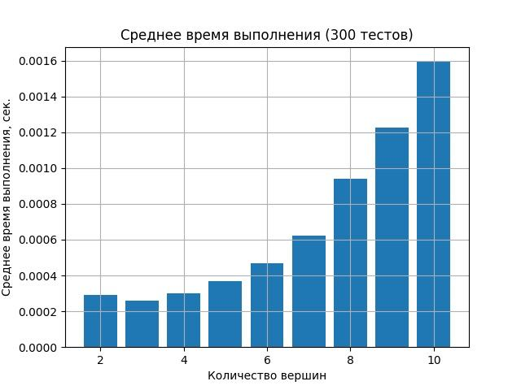

Результаты тестов со шкалой количества заходов.

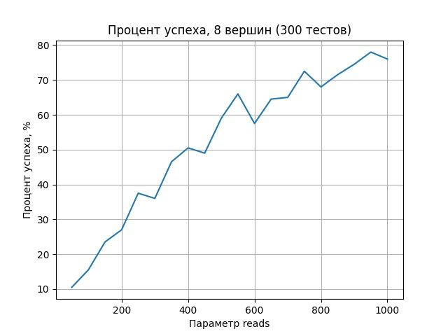

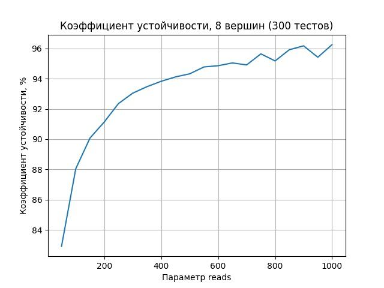

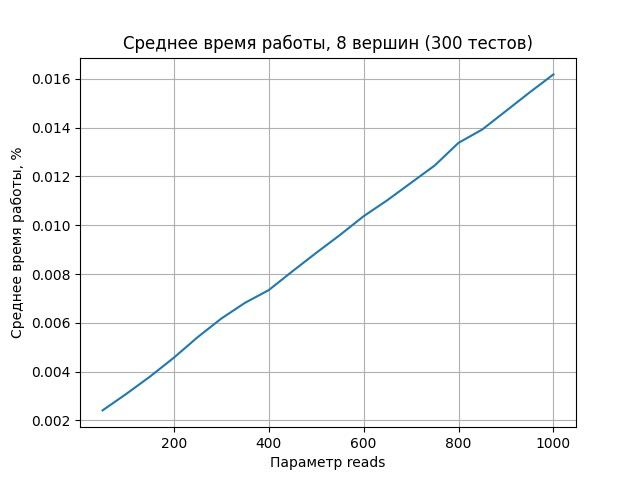

## Tabu Search
Результаты тестов на дефолтных параметрах сэмплера(500 тестов).

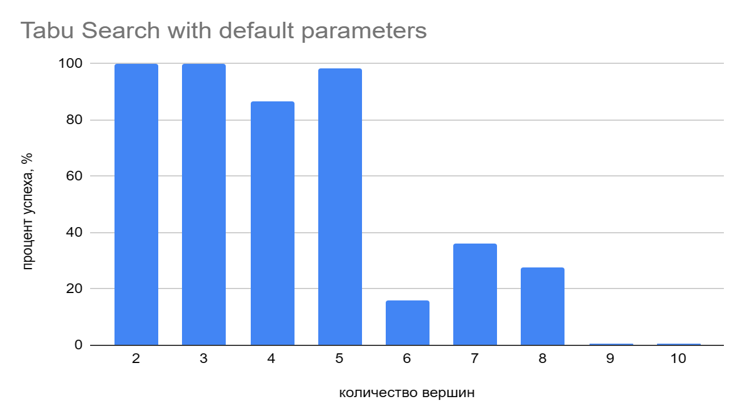

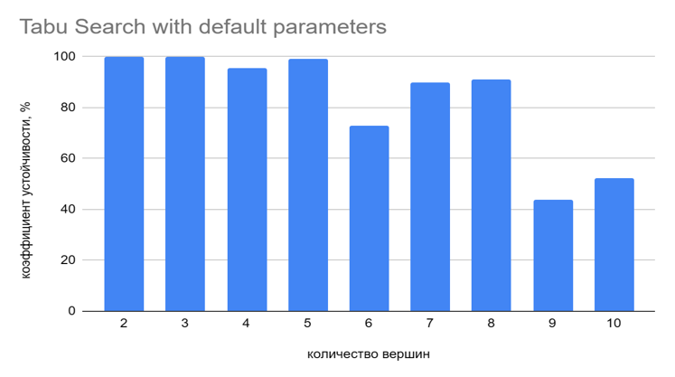

Время постоянно и равно ~ 0,021 секунд.

Результаты тестов со шкалой количества заходов(500 тестов).

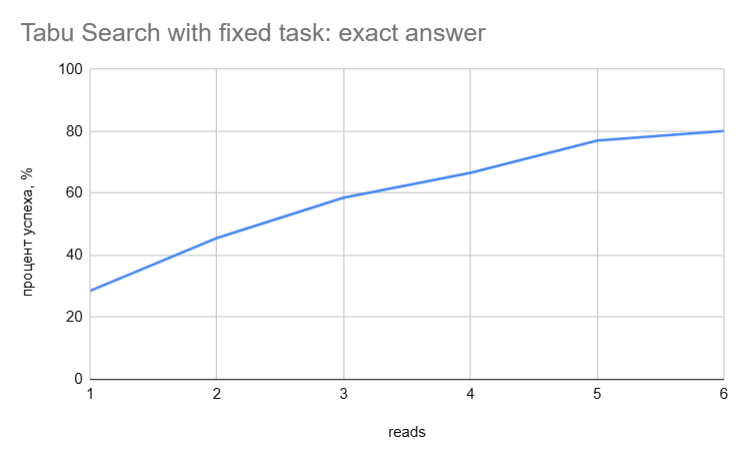

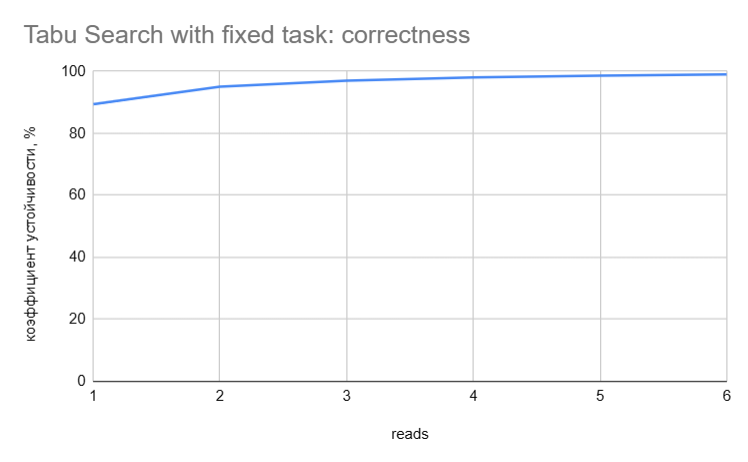

Время линейно зависит от количества заходов (время одного захода: ~ 0,021 секунд).

## Simulated Annealing
Результаты тестов со шкалой количества заходов и несколькими кривыми, отвечающими за различное количество вершин.
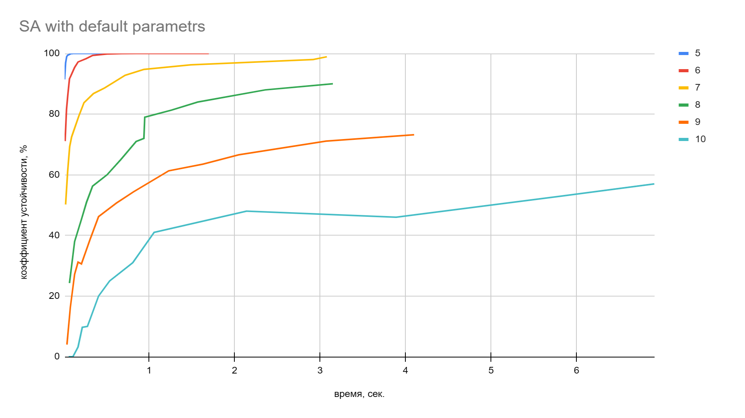

Те же исходные, кроме изменения параметра `beta_range` с дефолтного на `[0.1, 0,2]`.
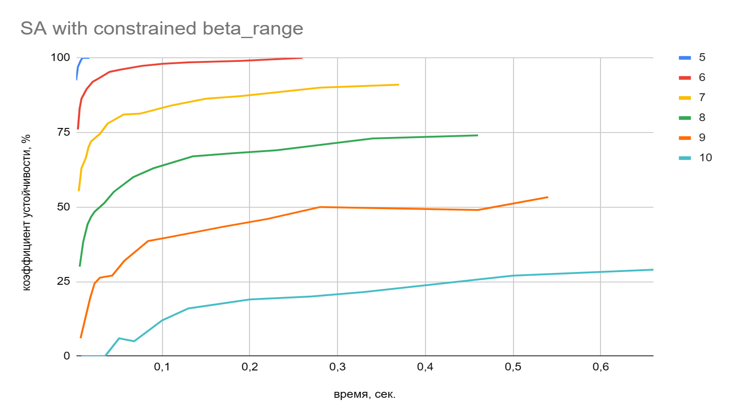

Время одного захода зависит непостоянно и зависит от размера матрицы QUBO, размер которой равен четвёртой степени количества вершин в графе.