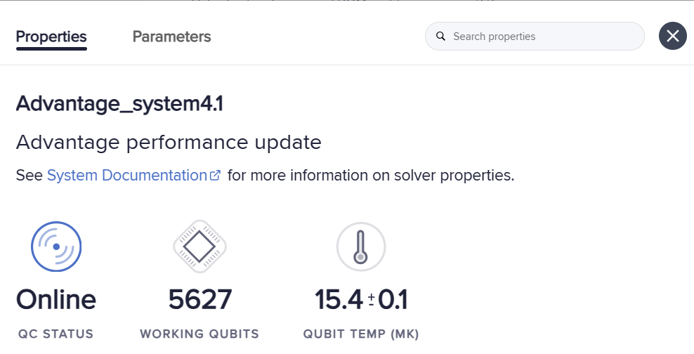

# Задачи на реальном квантовом компьютере.
## Leap
Dwave предоставляет ограниченный доступ к своим Quantum Processor Unit через облачный сервис Leap.
Таким образом, можно отправлять свои задачи на квантовый компьютер.
## Сравнение
Задача: TSP.

Количество вершин: 8.

Распределение: рандомное геометрическое.

||Simulated Annealing|QPU|
|---|---|---|
|Tests|20|20|
|Valid|20|19|
|Avg time, sec|0,58|0,59|
|Avg gap|8,8%|51,2%|

\* $\LARGE gap = \frac{sampler\textunderscore dist \ - \ dynam\textunderscore dist}{ dynam\textunderscore dist} $

В качестве эталонного ответа использовался результат динамического решения задачи из библиотеки [python_tsp](https://pypi.org/project/python_tsp/).
Параметры для сэмплера были подобраны таким образом, чтобы время работы приблизительно совпадало. Для сэмплера было выбрано num_reads = 1700, а для QPU num_reads = 3800 и annealing_time = 1.

В документации Dwave есть множество различных способов привести QUBO формулировку к той, которая соответствует топологии QPU. Здесь была использована следующая конструкция:
```
bqm = BinaryQuadraticModel.from_qubo(qubo)
sampler = DWaveSampler()
sampleset = EmbeddingComposite(sampler).sample(bqm, num_reads = 3800, annealing_time = 1)
```

Задачи отправлялись на следующий QPU:


