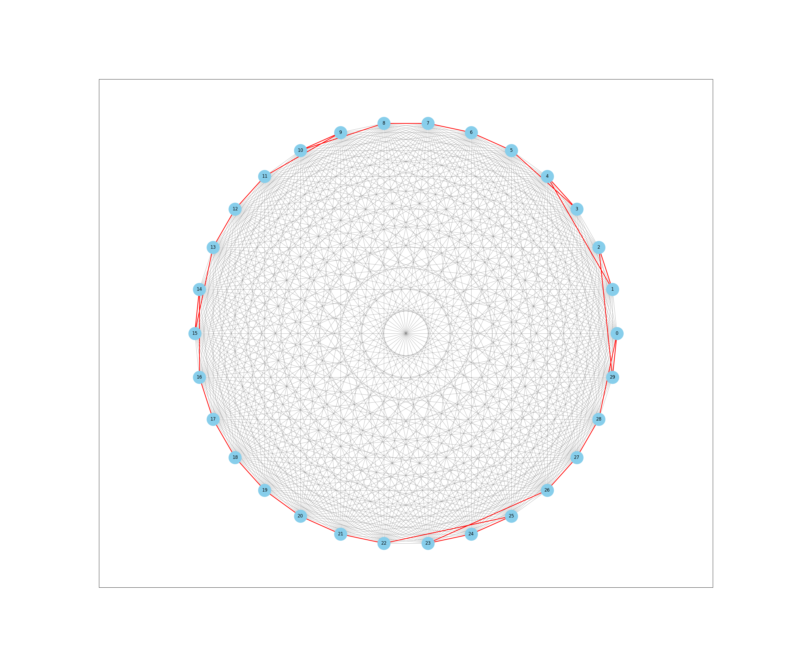
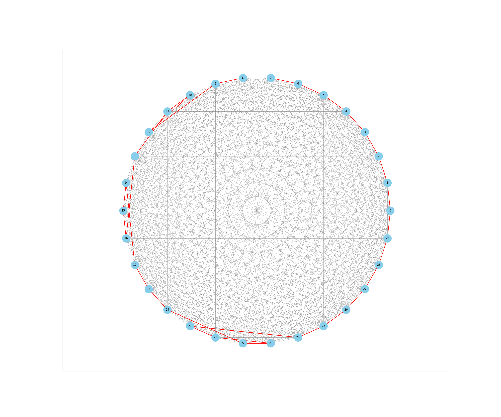
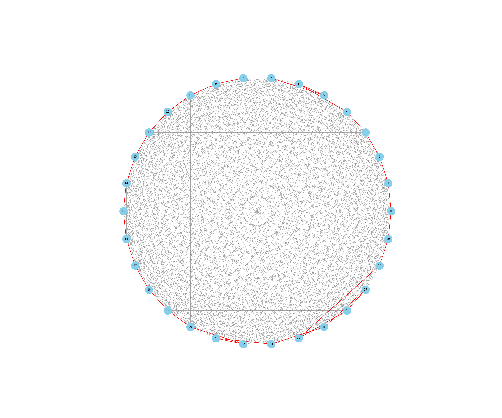
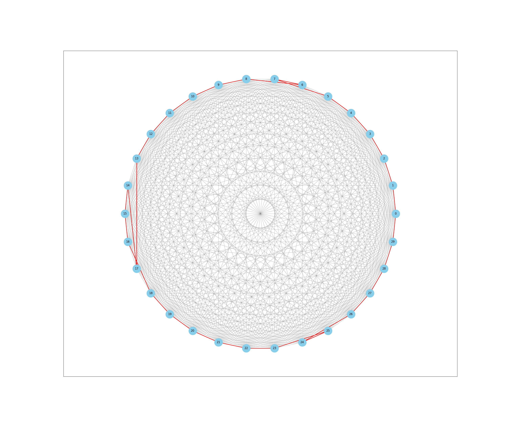
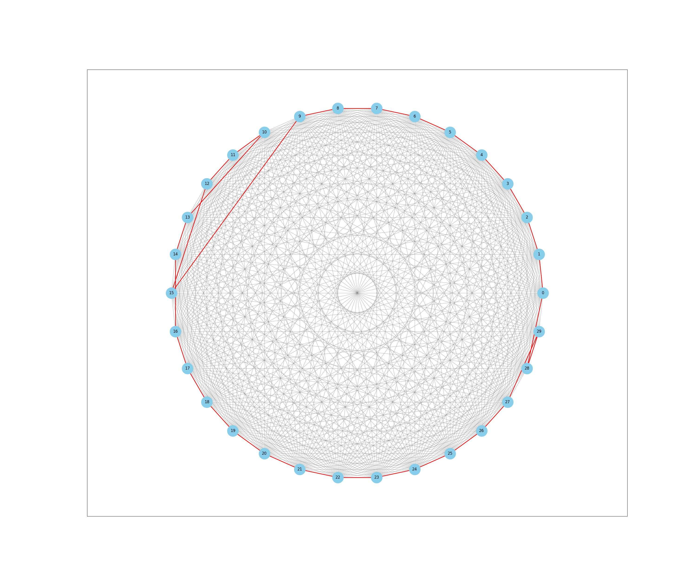
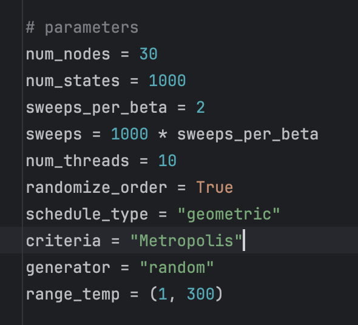
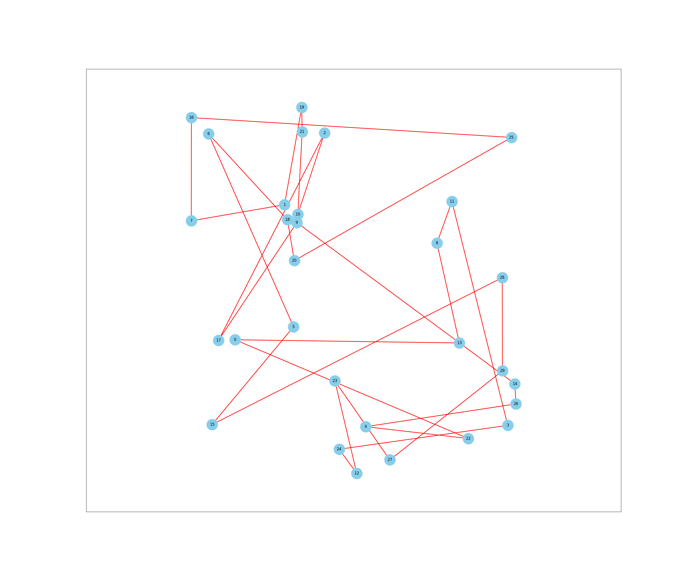
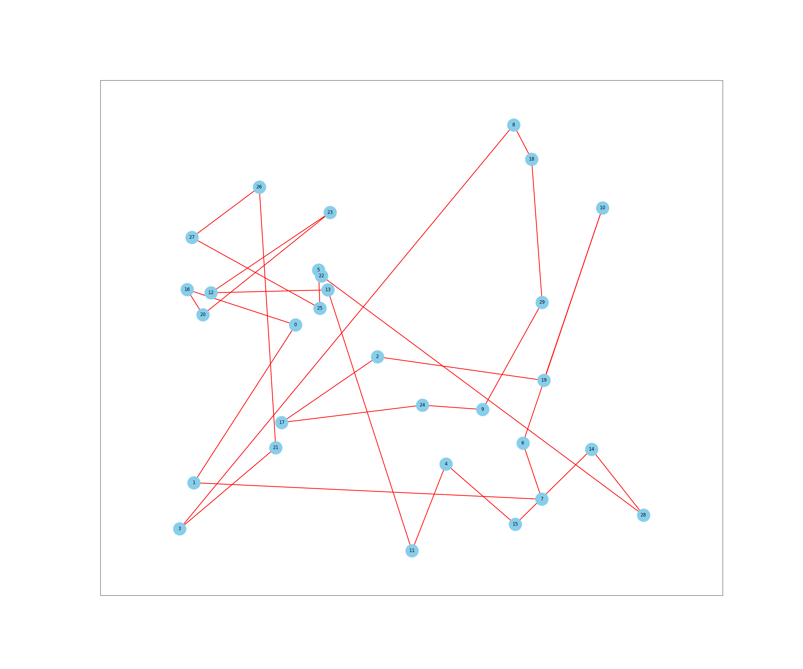
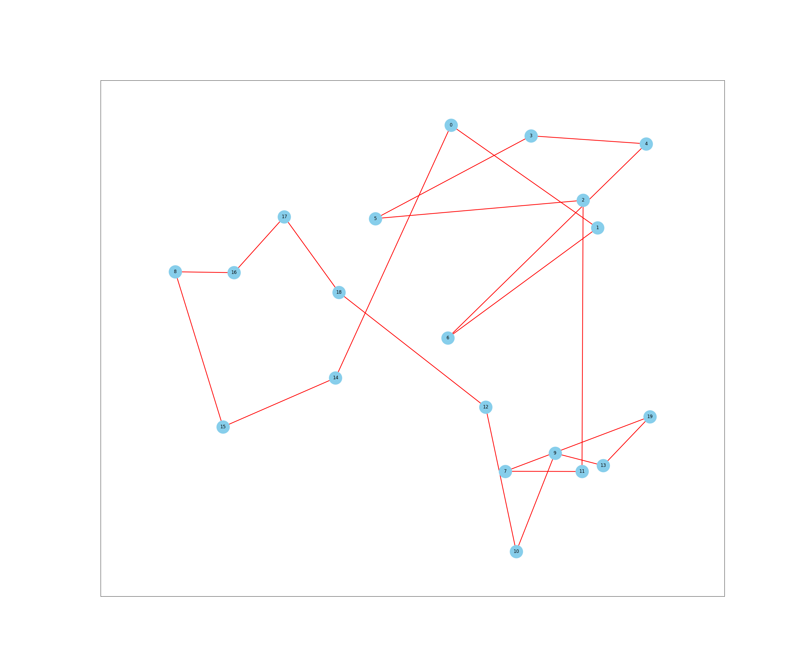

# Polynom тесты на разных семплерах

## Stepest Decent Sampler

Результат с 30 вершинами, 100000 случайных начальных состояний

Результат с 30 вершинами, 1000000 случайных начальных состояний
Время работы - ~15 минут

Результат с 30 вершинами, 10000 случайных начальных состояний, 20 потоков
Время работы - ~1,5 минут

Результат с 30 вершинами, 20000 случайных начальных состояний, 20 потоков
Время работы - ~2 минуты

Результат с 30 вершинами, 10000 случайных начальных состояний, 40 потоков
Время работы - ~2,3 минуты

[//]: # (![]&#40;polynom/sticker.webp&#41;)

Результат с 30 вершинами, 30000 случайных начальных состояний, 50 потоков
Время работы - ~??? минуты

## Simulated Annealing Sampler

Не знаю что происходит, все ужасно...
Не получилось подобрать параметры для более менее нормальных результатов

# Random тесты на разных семплерах

## Simulated Annealing

## Steepest Decent Solver

Кол-во вершин - 30, кол-во начальных состояний - 20000, потоков - 10
Время выполнения - ~4 мин

Кол-во вершин - 30, кол-во начальных состояний - 20000, потоков - 10
Время выполнения - ~1.5 мин

Кол-во вершин - 20, кол-во начальных состояний - 10000, потоков - 10
Время выполнения - ~30 сек

